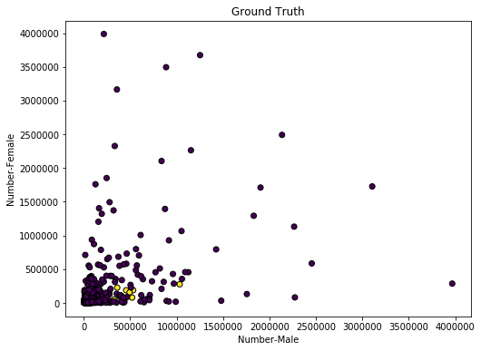

  

      <ul class="nav">
          <li><a href="Full_SPLOM.html">prev</a></li>
          <li><a href="3d_kmeans_pay.html">next</a></li>
      </ul>
  

[K means clustering](https://scikit-learn.org/stable/auto_examples/cluster/plot_cluster_iris.html) is shown in this example from the scikitlearn documentation.  

K-means clustering was used to assess if STEM occupations cluster in a way to subvert or heavily influence the trend of men being paid more than women. The STEM occupations are in yellow and the non-STEM purple. Here, the only thing that is apparent is that there is a greater number of men than women in the STEM occupations.

The data for this analysis came from [“ACS 5-Year Estimates - Public Use Microdata Sample” for 2017 from the US Census Bureau](https://data.census.gov/mdat/#/) and from [Occupational Employment Statistics from the Bureau of Labor Statistics](https://www.bls.gov/oes/topics.htm#stem)
