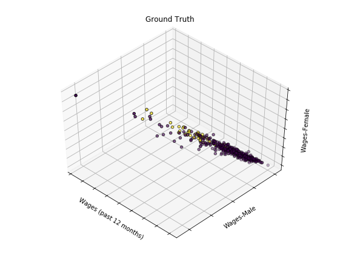

  

      <ul class="nav">
          <li><a href="2d_kmeans_num.html">prev</a></li>
          <li><a href="samplemixups_fig7.html">next</a></li>
      </ul>
  

Tian J, Keller MP, Broman AT, Kendziorski C, Yandell BS, Attie AD,
Broman KW. The dissection of expression quantitative trait locus
hotspots. [Genetics](http://genetics.org), to appear

**Figure 4**. &mdash; Scatterplots of the first two linear
discriminants for the trans-eQTL hotspot on chromosome 10, here
considering three tissues: adipose, kidney, and liver. Points
correspond to mice, and they are colored according to their two-locus
genotypes, for the inferred two QTL model, with one locus at 48 cM and
the other at 54 cM.
