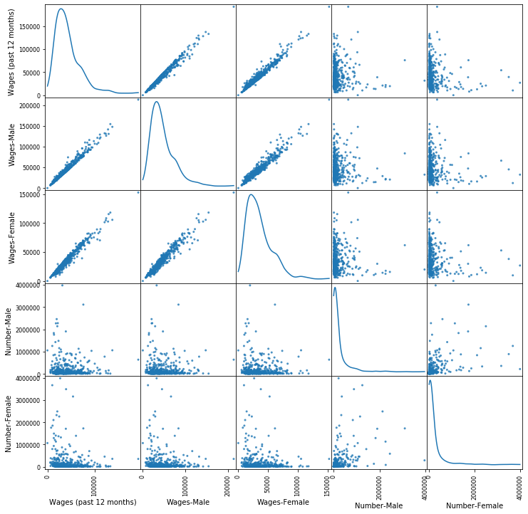

  

      <ul class="nav">
          <li><a href="Norm_hist.html">prev</a></li>
          <li><a href="2d_kmeans_num.html">next</a></li>
      </ul>
  

Python's pandas package has a convenient method to create a [scatterplot matrix](https://pandas.pydata.org/pandas-docs/stable/reference/api/pandas.plotting.scatter_matrix.html) or SPLOM.

From this SPLOM, a few things are clear. First and most obvious, each element is highly correlated to itself. Moreover, each of the wages subsets are highly correlated, though it is difficult to determine how highly. This is not surprising because women and men both make up a significant portion of the workforce, and their wages are both used to calculate the total wages. Also, if women’s and men’s wages were not highly correlated, it would be obvious to even the most casual observer that women and men were being paid differently and that rampant discrimination based on gender exists. The remainder of the elements do not seem that highly correlated. This suggests that the hypothesis that a greater number of women being in an occupation influences women’s pay may not hold water.
