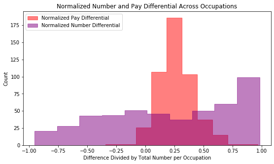

  

      <ul class="nav">
          <li><a href="3d_kmeans_pay.html">prev</a></li>
          <li><a href="isletc6_fig4.html">next</a></li>
      </ul>
  

Given an apparent correlation between men's and women's pay, it is worth looking at this data in a different way that removes this inherent correlation. While it seems that pure numbers of women in an occupation does not make it more pay equitable, the differential in numbers between the genders may still have influence on the differential in pay. To test this, the data was manipulated to create two new variables: normalized pay differential and normalized number differential.
